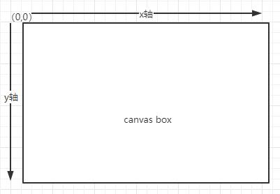

---
# 当前页面内容标题
title: 初步认识Canvas
# 分类
category:
  - 图形
  - canvas
# 标签
tag:
  - 图形
  - canvas
sticky: false
# 是否收藏在博客主题的文章列表中，当填入数字时，数字越大，排名越靠前。
star: false
# 是否将该文章添加至文章列表中
article: true
# 是否将该文章添加至时间线中
timeline: true
---

# 初步认识Canvas

Canvas API 提供了一个通过JavaScript 和 HTML的`<canvas>`元素来绘制图形的方式。它可以用于动画、游戏画面、数据可视化、图片编辑以及实时视频处理等方面。

Canvas API 主要聚焦于 2D 图形。而同样使用`<canvas>`元素的 WebGL API 则用于绘制硬件加速的 2D 和 3D 图形。
> 源自 [MDN_CANVAS](https://developer.mozilla.org/zh-CN/docs/Web/API/Canvas_API)


::: normal-demo 绘制填充矩形
```html
<canvas id="canvas" width="100" height="100"></canvas>
```

```js
// 获取目标元素
const el = document.getElementById("canvas");
//const ctx:CanvasRenderingContext2D = el.getContext('2d')
const ctx = el.getContext('2d');
/*
 绘制矩形
 fillRect(x,y,width,height)
 x: 矩形起始点的 x 轴坐标。
 y: 矩形起始点的 y 轴坐标。
 width: 矩形的宽度。
 height: 矩形的高度。
 */
ctx.fillRect(0,0,50,50);
```
:::

通过`el.getContext('2d')`获取canvas画布的2d渲染山下文，canvas提供了一系列[api](https://developer.mozilla.org/zh-CN/docs/Web/API/CanvasRenderingContext2D)来渲染画布图形，其中`fillRect`,可以绘制一个填充矩形。参数中`x,y`标识的是填充矩形在canvas坐标系中的起始位置，`width,height`标识的是填充矩形的宽高。canvas坐标系如下图所示



`canvas box`就是标签绘制的画布范围，canvas初始坐标系的起点位置（`(0,0)`）位于左上角。
