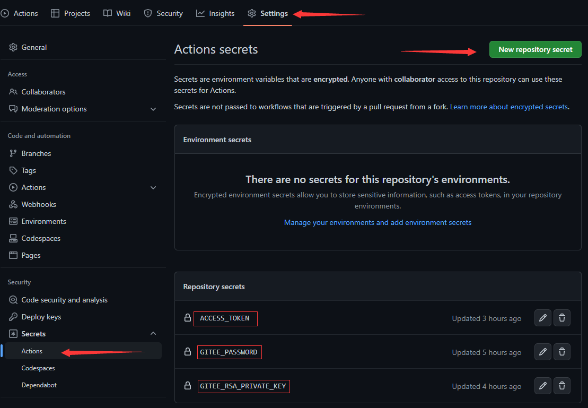
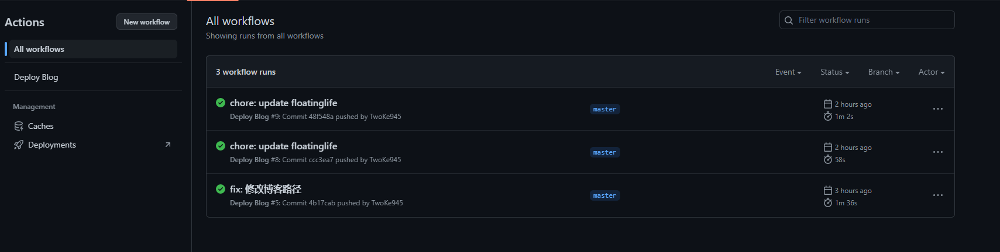

# 自动部署Gitee Pages

## 博客部署

- github
  1. 采用Github action工作流部署
- gitee
  1. 购买Gitee Pages Pro
  2. 获得Gitee 官方的优质项目
  3. 使用Github action工作流，同步到Gitee

根据上述的两种分析，采用的是Github action同步Gitee

## 准备工作

- 配置Secret变量

  - GITEE_RSA_PRIVATE_KEY (Gitee SSH 私钥)
  - GITEE_PASSWORD (Gitee 登录密码)




- 创建工作流

  - 在项目目录下创建.github/workflows目录
  - 在目录下编写工作流文件 deploy.yml

```yml 
# 工作流名
name: Deploy Blog

# 监听的指令 - push -> 分支 - master
on:
  push:
    branches: [ master ]

# 一个工作流由多个任务组成
jobs:
  # 任务名为deploy，可以自定义名 -> build-deploy、build等等
  deploy:
  # 运行环境
    runs-on: ubuntu-latest
    steps:
    # 同步Gitee
    - name: Sync to Gitee
      uses: wearerequired/git-mirror-action@master
      env:
          # 注意在 Settings->Secrets 配置 GITEE_RSA_PRIVATE_KEY
          SSH_PRIVATE_KEY: ${{ secrets.GITEE_RSA_PRIVATE_KEY }}
      with:
          # 注意替换为你的 GitHub 源仓库地址
          source-repo: "git@github.com:TwoKe945/blog.git"
          # 注意替换为你的 Gitee 目标仓库地址
          destination-repo: "git@gitee.com:twoke/blog.git"
    # 更新Gitee Pages
    - name: Build Gitee Pages
      uses: yanglbme/gitee-pages-action@master
      with:
          # 注意替换为你的 Gitee 用户名
          gitee-username: twoke
          # 注意在 Settings->Secrets 配置 GITEE_PASSWORD
          gitee-password: ${{ secrets.GITEE_PASSWORD }}
          # 注意替换为你的 Gitee 仓库
          gitee-repo: twoke/blog
          # 分支
          branch: master
          # 文档目录
          directory: src/.vuepress/dist
          # 强制使用https
          https: true
```

## 使用工作流

当提交记录时，会触发工作流，执行自动同步部署博客。


